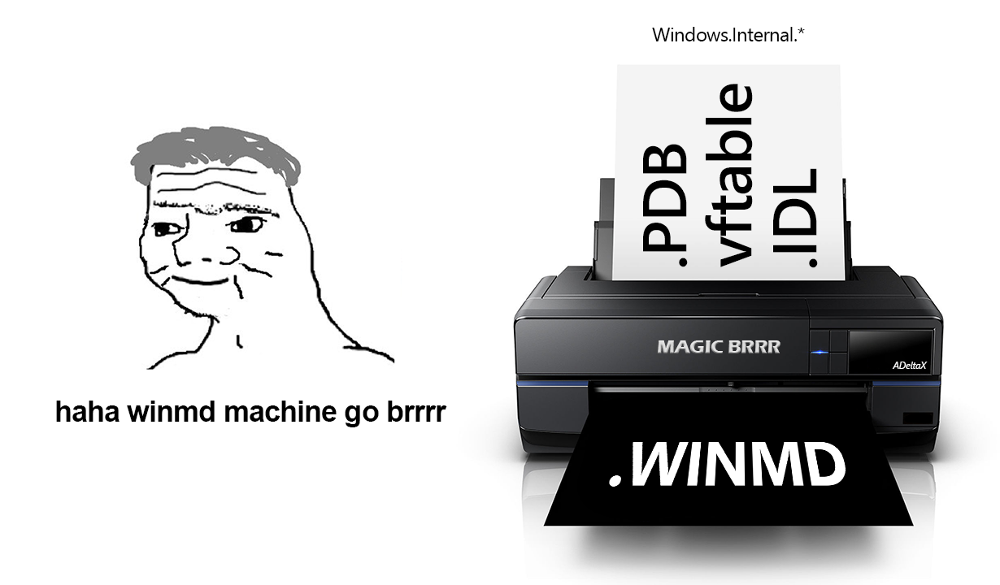

# InternalWinMD
haha winmd machine go brrrr

This repo contains all the winmd/idl that I made from pdb/vftables/registry (HKLM\SOFTWARE\Microsoft\WindowsRuntime\ActivatableClassId\*)
I don't guarantee that it works everywhere or if it is correct.
